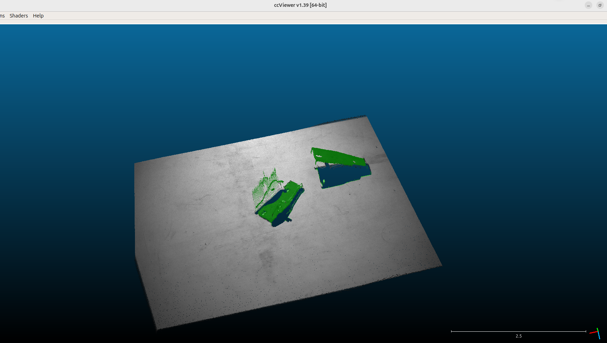

# google doc Turorial:

yolov8-seg 語意分割以及fastSAM半自動標記  
https://docs.google.com/document/d/1u7WO6BaYkGGyNSNZAwpgprw3cZJk9e9gwGdMDX0pWjM/edit?usp=sharing

# Segment

<p align="center">
  
</p>


Image segmentation pipeline for point cloud segmentation and downstream 6DoF pose estimation.

This project uses AnyLabeling with Segment Anything to annotate objects, converts JSON annotations into YOLO segmentation format, and trains YOLOv8 segmentation models for object masks. The segmentation result can then be used for point cloud segmentation and 6DoF pose estimation in robotic grasping applications such as random bin picking.

# Point Cloud Segmentation & 6DoF Pose Estimation Pipeline

本專案目標是透過 **物件分割（Instance / Semantic Segmentation）**，輔助後續進行 **點雲分割**，並進一步應用於 **6DoF Pose Estimation**，例如無序抓取（Random Bin Picking）等機器人視覺任務。

---

## 線上文件

線上版文件施工中：

[Google Docs 文件](https://docs.google.com/document/d/1eHZjBa0j4jhcv6vLaaeBCnXzD-eSQKdp/edit?usp=sharing&ouid=111562241696057241699&rtpof=true&sd=true)

---

## GitHub Repository

專案位置：

[https://github.com/FREEMAN-Inc/segment](https://github.com/FREEMAN-Inc/segment)

---

## 專案目的

本專案主要流程：

1. 使用 AnyLabeling 進行物件分割標註
2. 將標註好的 JSON 轉換為 YOLO segmentation 訓練格式
3. 使用 YOLOv8 segmentation 進行模型訓練與推論
4. 根據影像分割結果對點雲進行分割
5. 後續可進一步銜接 6DoF Pose Estimation
6. 應用於機器人無序抓取、物件定位與姿態估測

---

## 安裝環境

本專案建議使用 `opencv-python-headless`，避免 GUI 版本 OpenCV 與其他套件發生衝突。

```bash
pip install anylabeling==0.4.30
pip install opencv-python-headless==4.7.0.72
````

---

## 標註工具：AnyLabeling

本專案使用 AnyLabeling 進行物件分割標註。

PyPI 連結：

[https://pypi.org/project/anylabeling/](https://pypi.org/project/anylabeling/)

---

## AnyLabeling 使用方式

啟動 AnyLabeling：

```bash
anylabeling
```

進入介面後：

1. 點擊左下角的大腦圖示
2. 選擇模型：

```text
Segment Anything ViT B quant
```

3. 點擊上方工具列：

```text
+Point(Q)
```

4. 使用滑鼠點擊目標物件
5. 系統會自動產生分割標記

AnyLabeling 主要用於標註物件分割資料，輸出格式通常為 JSON。

---

## JSON 轉 YOLO Segmentation 格式

標註完成後，需要將 AnyLabeling 輸出的 JSON 轉換成 YOLO segmentation 訓練格式。

轉換工具：

[json2yolo_seg_folder.py](https://github.com/FREEMAN-Inc/segment/blob/main/json2yolo_seg_folder.py)

---

## 使用方式

假設資料夾結構如下：

```text
project/
├── annots/
│   ├── image_001.json
│   ├── image_002.json
│   └── ...
├── labels/
└── json2yolo_seg_folder.py
```

執行轉換：

```bash
python json2yolo_seg_folder.py \
  --input-dir ./annots \
  --output-dir ./labels \
  --class-map "medium:0,small:1,large:2"
```

---

## 參數說明

| 參數             | 說明                            |
| -------------- | ----------------------------- |
| `--input-dir`  | AnyLabeling 匯出的 JSON 標註資料夾    |
| `--output-dir` | YOLO segmentation label 輸出資料夾 |
| `--class-map`  | 類別名稱與 YOLO class id 的對應關係     |

範例：

```bash
--class-map "medium:0,small:1,large:2"
```

代表：

| 類別名稱   | Class ID |
| ------ | -------- |
| medium | 0        |
| small  | 1        |
| large  | 2        |

---

## YOLOv8 Segmentation 訓練與推論

訓練與推論相關程式位於：

[image-segmentation-yolov8](https://github.com/FREEMAN-Inc/segment/tree/main/image-segmentation-yolov8)

---

## 整體流程

```text
Image Dataset
    ↓
AnyLabeling 標註
    ↓
JSON Annotation
    ↓
json2yolo_seg_folder.py
    ↓
YOLO Segmentation Label Format
    ↓
YOLOv8 Segmentation Training
    ↓
Segmentation Inference
    ↓
Point Cloud Segmentation
    ↓
6DoF Pose Estimation
    ↓
Random Bin Picking / Robot Grasping
```

---

## 應用場景

本專案可應用於：

* 點雲分割
* 物件語意分割
* 實例分割
* 6DoF Pose Estimation
* 機器人無序抓取
* 工業自動化視覺定位
* RGB-D 相機物件辨識與姿態估測

---

## 注意事項

### OpenCV 版本

建議安裝 headless 版本：

```bash
pip install opencv-python-headless==4.7.0.72
```

避免安裝 GUI 版本：

```bash
pip install opencv-python
```

否則可能會遇到 GUI plugin、Qt、X11 或套件相依性衝突問題。

---

## Reference

* AnyLabeling
  [https://pypi.org/project/anylabeling/](https://pypi.org/project/anylabeling/)

* Segment Repository
  [https://github.com/FREEMAN-Inc/segment](https://github.com/FREEMAN-Inc/segment)

* JSON to YOLO Segmentation Converter
  [json2yolo_seg_folder.py](https://github.com/FREEMAN-Inc/segment/blob/main/json2yolo_seg_folder.py)

* YOLOv8 Segmentation Training and Inference
  [image-segmentation-yolov8](https://github.com/FREEMAN-Inc/segment/tree/main/image-segmentation-yolov8)

````

可以再補一個更短的開頭版本：

```markdown
# Segment

Image segmentation pipeline for point cloud segmentation and downstream 6DoF pose estimation.

This project uses AnyLabeling with Segment Anything to annotate objects, converts JSON annotations into YOLO segmentation format, and trains YOLOv8 segmentation models for object masks. The segmentation result can then be used for point cloud segmentation and 6DoF pose estimation in robotic grasping applications such as random bin picking.
````

